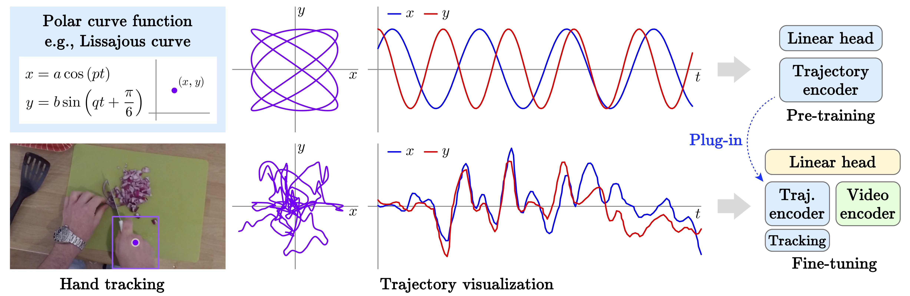

# PolarDB: Formula-driven Dataset for Pre-training Trajectory Encoders

## Abstract
Formula-driven supervised learning (FDSL) is a relatively new research topic for finding simple mathematical formulas that generate synthetic data and labels for pre-training neural networks. The main advantage of FDSL is that there is nearly no risk of generating data with ethical implications such as gender bias and racial bias because it does not rely on real data as discussed in previous literature using fractals and well-designed polygons for pre-training image encoders. In this paper, we introduce PolarDB, the first formula-driven dataset for pre-training trajectory encoders with an application to fine-grained cutting-method recognition using hand trajectories. More specifically, we generate 270k trajectories for 432 categories on the basis of polar equations and use them to pre-train a Transformer-based trajectory encoder in an FDSL manner. In experiments, we show that pre-training on PolarDB improves the accuracy of fine-grained cutting-method recognition on cooking videos of EPIC-KITCHEN and Ego4D datasets, where the pre-trained trajectory encoder is used as a plug-in module for a video recognition network.


## PolarDB dataset

The PolarDB consists of trajectories synthesized on the basis of polar equations. The dataset will be saved to PolarDB.pkl.
   ```shell
   python modules_FDSL/create_dataset.py --save_name ./PolarDB.pkl --spatial_noise --temporal_noise 
   ```

Low-level features including velocity and acceleration are extracted from PolarDB.
   ``` shell
   python modules_FDSL/extract_features.py --dataset_path PolarDB.pkl --output_path /path/to/polardb_features --relative --velocity --acceleration
   ```

## Cutting-Method Recognition Results

[Temporal Binding Network](https://github.com/ekazakos/temporal-binding-network) is used for evaluation. The annotation data can be found under "annotations".

### EPIC-KITCHENS

| Method | Action | Object | Both |
| :--- | :---: | :---: | :---: |
| RGB encoder | 61.01 | 94.91 | 59.32 |
| Flow encoder | 38.98 | 64.40 | 28.81 |
| Audio encoder | 44.06 | 94.91 | 42.37 |
| Trajectory encoder | 35.59 | 38.98 | 15.25 |
| Baseline (RGB + Flow + Audio) | 64.97 | 92.65 | 62.71 |
| Ours (w/o pre-training) | 66.10 | 94.35 | 63.84 |
| Ours (w/ PolarDB) | **74.58** | **94.35** | **71.75** |

### Ego4D

| Method | Action | Object | Both |
| :--- | :---: | :---: | :---: |
| RGB encoder | 69.39 | 93.98 | 65.57 |
| Flow encoder | 51.36 | 63.93 | 40.43 |
| Audio encoder | 53.00 | 72.67 | 42.07 |
| Trajectory encoder |39.34 | 25.68 | 9.83 |
| Baseline (RGB + Flow + Audio) | 69.22 | 95.81 | 68.12 |
| Ours (w/o pre-training) | 73.04 | 96.17 | 71.58 |
| Ours (w/ PolarDB) | **74.68** | **96.17** | **73.41** |

## Citing

Please use the following citation for this work:

```
@InProceedings{miyamoto2024polardb,
    author    = {Miyamoto, Sota and Yagi, Takuma and Makimoto, Yuto and Ukai, Mahiro and Ushiku, Yoshitaka and Hashimoto, Atsushi and Inoue, Nakamasa},
    title     = {PolarDB: Formula-driven Dataset for Pre-training Trajectory Encoders},
    booktitle = {(Under submission at ICASSP)},
    year      = {2024}
}
```

## Acknowledgement
We would like to thank authors of the following codebase.

- [Temporal Binding Network](https://github.com/ekazakos/temporal-binding-network)

